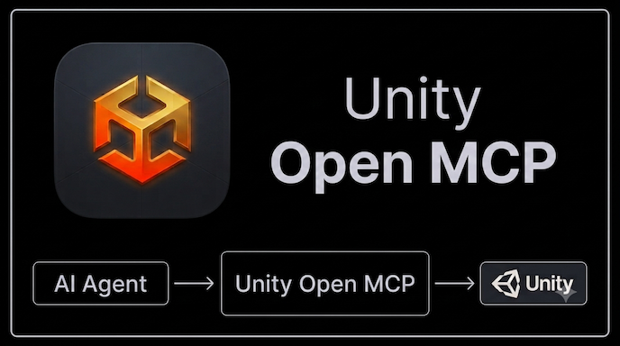

  

| [English](README.md) | [简体中文](docs/i18n/README-zh.md) |
|----------------------|---------------------------------|

# Unity Open MCP

Unity Open MCP connects AI agents to Unity projects with a bridge + gate workflow: make changes, run validation, inspect results, and iterate safely.

Requires **Unity 2022.3 LTS or newer** (Unity 6 recommended).

The MCP server consist of a total of **160** tools.

Current tool surface from `mcp-server/src/tools/index.ts`:

- Core + gate + validation tools: **16**
- Asset intelligence + senses + discovery + diagnostics tools: **16**
- Typed editor/project tools (core package): **97**
- Optional extension-pack tools: **31**

## Quick setup

Use any of this options:

1. Use the **AI Setup wizard** in Unity Hub Pro (recommended): [Wizard setup](docs/wizard-setup.md).
2. If you prefer manual setup and client config snippets: [Manual setup](docs/manual-setup.md).

Optional: install extension packs for domain-specific workflows: [Extensions](docs/extensions.md).

## Key features

- Safe mutation workflow with gate validation, checkpoints, deltas, regression checks, and targeted fixes.
- Asset intelligence tools including reserialize, structured asset read/search, and reference analysis.
- Live + fallback routing (live Unity bridge, batch mode for supported tools, offline readers where possible).
- Typed Unity tool surface for scenes, GameObjects, components, packages, build settings, profiler controls, and project settings.
- Bundled domain tool groups for Navigation, Input System, ProBuilder, Particle System, and Animation — embedded in the bridge, compiled in automatically when the matching Unity package is present, and surfaced per session via tool groups.
- Unity Hub Pro wizard for guided setup and maintainer workflows.

For the full catalog and contracts, see [docs/api/mcp-tools.md](docs/api/mcp-tools.md).

> Looking at other options? See the [MCP tools for Unity comparison](docs/mcp-tools-comparison.md) — a side-by-side feature matrix of Unity Open MCP and the other MCP tools / AI assistants in the space.

## Documentation

- [Development setup](docs/development-setup.md) — local checkout, building the MCP server, contributor and maintainer workflows.
- [Architecture](docs/architecture.md) — repository boundaries and runtime flow.
- [Skills](docs/skills.md) — agent playbooks (`SKILL.md`) shipped into a project.
- [API index](docs/api.md) — contract documentation map.
- [Bridge HTTP API](docs/api/bridge-http.md) — bridge endpoints and envelopes.
- [MCP resources API](docs/api/resources.md) — resource URIs and payloads.
- [Code conventions](docs/code-conventions.md) — non-obvious C# decisions (instance IDs, namespace aliasing).

Setup, the tools API, the Hub, extensions, and the comparison matrix are linked in their own sections above.

## Unity Hub Pro

  

Unity Hub Pro is the desktop companion app for Unity Open MCP. It helps you manage projects, run the AI Setup wizard, and handle maintainer workflows from one UI.
[See docs for details.](docs/unity-hub-pro.md)

## Contributing

- Open issues for bugs, feature requests, and documentation improvements.
- PRs are welcome for core packages, extension packs, and docs.
- Start with the docs above, then package-level READMEs for local development details.

Helpful resources for contributors or those who would liketo work on their own forls:
- [Validation Suite](validation-suite/README.md) — standalone app for guided manual validation; ships runnable scenario packs (e.g. the `hexa-sort` build-and-validate pack).

**License:** MIT — see [LICENSE](LICENSE).