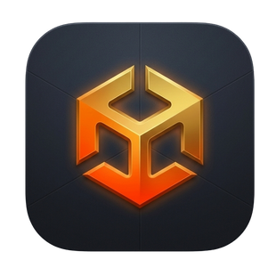
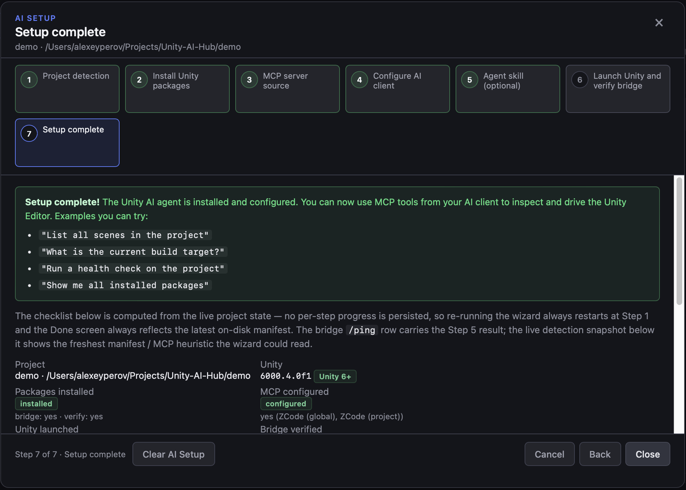

[](https://alexeyperov.github.io/unity-open-mcp/)
[](https://unity.com/releases/editor/archive)
[](https://modelcontextprotocol.io/introduction)
[](https://opensource.org/licenses/MIT)

<p align="center">
  
</p>

# Unity Open MCP

Unity Open MCP is a comprehensive set of tools to use AI agents with Unity projects.

The MCP server exposes **250+ tools** across typed editor workflows, gate and
validation, asset intelligence, diagnostics, and embedded domain groups.

## Key features

- Safe mutation workflow with **automatic validation, checkpoints, deltas, regression checks, and targeted fixes**.
- Asset intelligence tools including **reserialize, structured asset read/search, and reference analysis**.
- Live + fallback routing (live Unity bridge, batch mode for supported tools, offline readers where possible).
- Typed Unity tool surface for scenes, GameObjects, components, packages, build settings, profiler controls, and project settings.
- Bundled domain tool groups for **Navigation, Input System, ProBuilder, Particle System, Animation, Splines, Lighting, Audio, UI, Constraints & LOD, Terrain, Cinemachine, Timeline, Tilemap, Shader Graph, VFX Graph, and Memory Profiler** — embedded in the bridge, compiled in automatically when the matching Unity package is present (or unconditionally for built-in modules like Lighting, Audio, UI, Constraints & LOD, and Terrain; Cinemachine is reflection-gated — its assembly always compiles and detects the supported version at call time), and surfaced per session via tool groups. Shader Graph, VFX Graph, and Memory Profiler **auto-activate** — their tool groups appear automatically when the matching package is installed, no manual opt-in.
- Unity Hub Pro wizard for guided setup and maintainer workflows.

For the full catalog and contracts, see [docs/api/mcp-tools.md](docs/api/mcp-tools.md).

| Typical Unity MCP issue | How Unity Open MCP solves it |
|---|---|
| AI can mutate project state unsafely | Gate-based workflow with validation, checkpoints, deltas, regression checks, and targeted fixes |
| Weak asset visibility and cross-reference context | Asset intelligence tools for structured read/search, reserialize flows, and reference analysis |
| Tooling breaks when Unity/editor runtime is unavailable | Live bridge + batch fallback + offline readers where possible |
| Generic tools miss Unity-specific workflows | Typed tool surface for scenes, GameObjects, components, packages, build settings, profiler, and project settings |
| Domain workflows require custom setup | Domain tools embed in the bridge, compile when the Unity package is present, and surface as per-session tool groups |

## Quick setup

Requires **Unity 2022.3 LTS or newer**.

Use any of these options:

1. **Easiest (AI agent):** paste this prompt into your AI client (Cursor, Claude, …) and let it install for you:

```text
Install Unity Open MCP in this Unity project by following
https://raw.githubusercontent.com/AlexeyPerov/Unity-Open-MCP/master/docs/setup/agent-setup.md
exactly. Do every agent step yourself; stop and tell me only when a human action is required.
If this monorepo is already open locally, read docs/setup/agent-setup.md from disk instead of fetching.
```

Full procedure: [Agent setup](docs/setup/agent-setup.md).

2. If you prefer to edit config yourself: see [Manual setup](docs/setup/manual-setup.md).
3. If you prefer cloning this repo and working with it directly: see [Development setup](docs/setup/development-setup.md). Fits contributor workflow.

4. If you prefer setup via UI wizard see Unity Hub Pro: [Wizard setup](docs/setup/wizard-setup.md).



Domain tools (NavMesh, Input System, ProBuilder, lighting, Shader Graph, …) are embedded in the bridge — see [Extensions](docs/extensions.md) for the catalog and activation steps.

## Documentation

- [Agent setup](docs/setup/agent-setup.md) — let an AI agent install MCP + Unity packages.
- [Manual setup](docs/setup/manual-setup.md) — DIY MCP client config and UPM pins.
- [Wizard setup](docs/setup/wizard-setup.md) — Unity Hub Pro guided install.
- [Development setup](docs/setup/development-setup.md) — local checkout and contributor workflows.
- [Architecture](docs/architecture.md) — repository boundaries and runtime flow.
- [Dialog policy](docs/dialog-policy.md) — startup modal auto-dismiss and `UNITY_OPEN_MCP_DIALOG_POLICY`.
- [Troubleshooting](docs/troubleshooting.md) — bridge start failures, zombie listeners, and connectivity recovery.
- [Skills](docs/skills.md) — agent playbooks (`SKILL.md`) shipped into a project.
- [API index](docs/api.md) — contract documentation map.
- [Bridge HTTP API](docs/api/bridge-http.md) — bridge endpoints and envelopes.
- [MCP resources API](docs/api/resources.md) — resource URIs and payloads.
- [Code conventions](docs/code-conventions.md) — non-obvious C# decisions (instance IDs, namespace aliasing).
- [Versioning](docs/versioning.md) — how the shared server/bridge/verify version and the Hub app version are managed, bumped, and kept in sync; the runtime compatibility check.
- [CI templates](docs/ci/README.md) — GitHub Actions / GitLab CI templates for health checks, verify scans, and regression gates in standard CI.
- [Contributing — extensions](docs/contributing/extensions.md) — embedded domain gates, wiring checklist, community packs.

> Would like to see other MCP options? See the [MCP tools for Unity comparison](docs/mcp-tools-comparison.md) — a side-by-side feature matrix of Unity Open MCP and the other MCP tools / AI assistants in the space.

## Unity Hub Pro

Unity Hub Pro is the desktop companion app for Unity Open MCP. It helps you manage projects, run the AI Setup wizard, and handle maintainer workflows from one UI.
[See docs for details.](docs/unity-hub-pro.md)

## Contributing

- Feel free to open issues for bugs, feature requests, and documentation improvements.
- PRs are welcome. Start with the docs above, then package-level READMEs for local development details.

Helpful resources for contributors or those who would like to work on their own forks:
- [Validation Suite](validation-suite/README.md) — app for guided manual validation; ships runnable scenario packs.

**License:** MIT — see [LICENSE](LICENSE).