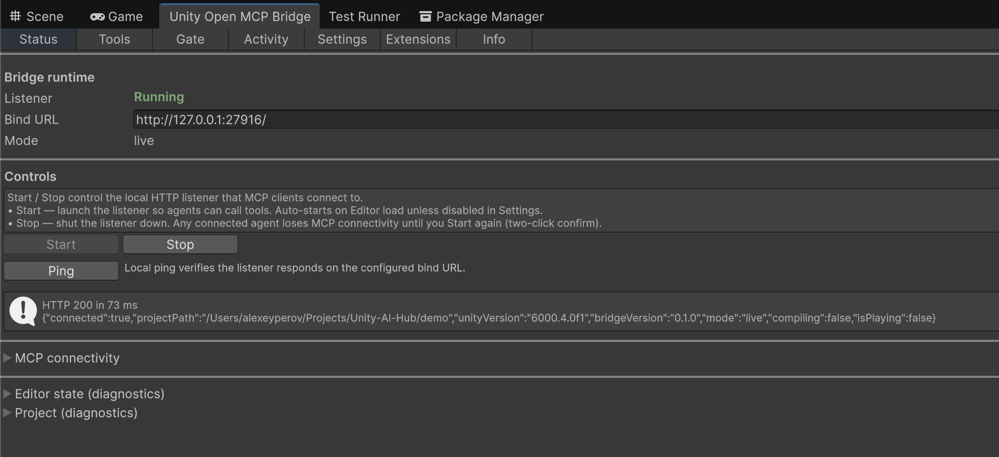
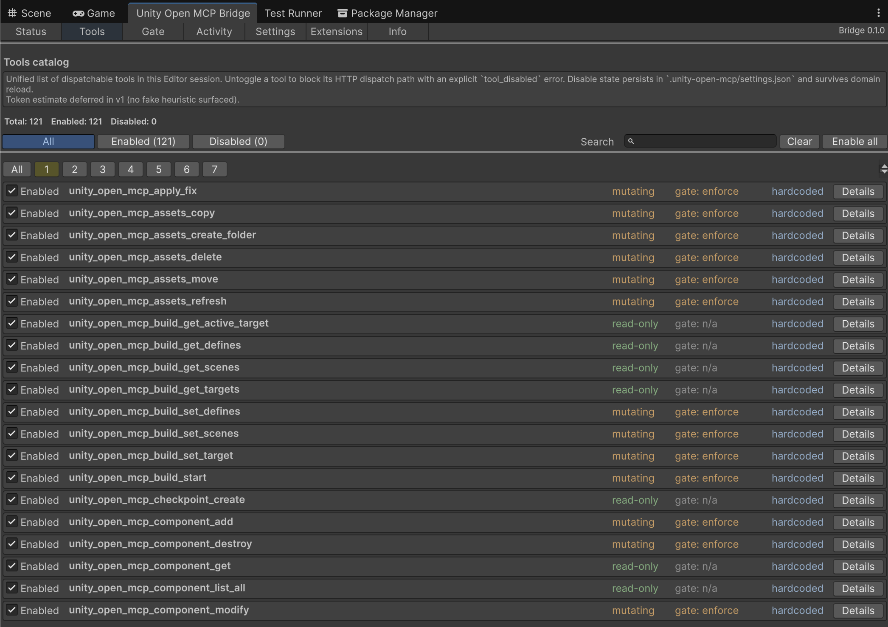

# MCP Tools API

This page summarizes the MCP tool surface exposed by `unity-open-mcp`.

> **Install / connect.** The MCP server ships on npm as [`unity-open-mcp`](https://www.npmjs.com/package/unity-open-mcp). Most users never install it manually — the AI client spawns it via `npx -y unity-open-mcp@latest` (no repo clone required). See [Manual setup](../manual-setup.md) for the full client-config snippets and environment variables, and the [Maintainer publish flow](../development-setup.md#maintainer-publish-flow) for how the package is published and updated.

For exact schemas, see tool files in `mcp-server/src/tools/` and use `unity_open_mcp_capabilities`.

|  |  |

## Tool families

- **Core runtime**: ping, C# execution, method invoke, menu calls, reflection, compile checks, editor status.
- **Gate and validation**: validate edit, checkpoints, deltas, reference scan, path scan, regression baseline/check, fixes.
- **Asset intelligence**: reserialize, read/search/list assets.
- **Agent senses**: tests, screenshots (scene/game/isolated, arbitrary camera pose, inline image, editor window), Frame Debugger (enable/disable/draw-call list), console read, profiler capture (per-frame + single-frame deep capture), memory/rendering snapshots, spatial queries, event pull.
- **Typed editor surface**: scenes, GameObjects, components, packages, profiler session controls, build/project settings, script/object helpers, ScriptableObject create + list-by-type, Assembly Definition (asmdef) list/get/create/modify.
- **Extension domains**: navigation, input system, probuilder, particle system, animation, splines, lighting, audio, ui, constraints, terrain, cinemachine, timeline, tilemap.
- **Discovery utilities**: capabilities, rules list, skill generation, manage_tools.

## Tool groups and session visibility

Sessions start with few main groups enabled. Every other group is hidden from `ListTools` until the agent activates it via `unity_open_mcp_manage_tools`. This keeps the prompt surface small (the full tool set is 221 tools) and mirrors Coplay's session-visibility model.

### Groups


| Group                | Default | Description                                                                                                                                                                     |
| -------------------- | ------- | ------------------------------------------------------------------------------------------------------------------------------------------------------------------------------- |
| `core`               | on      | ping, execute_csharp, invoke_method, find_members, execute_menu, editor_status                                                                                                  |
| `gate-and-verify`    | on      | validate_edit, checkpoint_create, delta, find_references, scan_paths, apply_fix, scan_all, baseline_create, regression_check                                                    |
| `asset-intelligence` | on      | reserialize, read_asset, search_assets, list_assets                                                                                                                             |
| `typed-editor`       | on      | typed editor surface (assets, materials, shaders, prefabs, GameObjects, components, scenes, packages, console, selection, undo, tags, layers, reflection, scripts, object data, ScriptableObject create + list-by-type, Assembly Definition list/get/create/modify) |
| `diagnostics`        | off     | Profiler session controls + per-frame capture/memory/rendering reads                                                                                                            |
| `gate-intelligence`  | off     | impact_preview, gate_budget_estimate, mutation_explain                                                                                                                          |
| `build-settings`     | off     | Build pipeline + ProjectSettings reads and mutators                                                                                                                             |
| `navigation`         | off     | NavMesh tools — compile-gated on `com.unity.ai.navigation`                                                                                                                      |
| `input-system`       | off     | Input System tools — compile-gated on `com.unity.inputsystem`                                                                                                                   |
| `probuilder`         | off     | ProBuilder modeling tools — compile-gated on `com.unity.probuilder`                                                                                                             |
| `particle-system`    | off     | Particle System tools — compile-gated on `UnityEngine.ParticleSystemModule`                                                                                                     |
| `animation`          | off     | AnimationClip + AnimatorController tools — compile-gated on `com.unity.modules.animation`                                                                                       |
| `splines`            | off     | Splines tools — compile-gated on `com.unity.splines`                                                                                                                            |
| `lighting`           | off     | Lighting tools — per-Light manipulation (add/set/modify), reflection probe bake (EditorSettle), skybox assignment. Built-in lighting module (always compiled)                   |
| `audio`              | off     | Audio tools — AudioSource add/modify, AudioMixer exposed-parameter set/get, AudioListener read (duplicate warning). Built-in audio module (always compiled)                      |
| `ui`                 | off     | UI (uGUI) tools — Canvas (+ CanvasScaler + GraphicRaycaster + EventSystem ensure), element add (Text/TMP_Text/Image/Button/Slider/Toggle/InputField), layout group add, element modify. Built-in UI module (always compiled); TMP_Text optional   |
| `constraints`        | off     | Constraints & LOD tools — animation constraints (Position/Rotation/Aim/Parent/Scale) add with source + weight + activation, LODGroup configure (fade mode / cross-fade / LOD array), LOD level add (per-index renderers). Built-in engine modules (always compiled)   |
| `terrain`            | off     | Terrain tools — create (TerrainData + GameObject), heightmap region write, splat layer paint, tree instance placement, neighbor stitching. Built-in Terrain module (always compiled); heightmap/splat writes cap at 513×513 per call (tile large writes)   |
| `cinemachine`        | off     | Cinemachine tools — create/configure virtual cameras, set targets/lens/Body/Noise, ensure Brain, list cameras. **Reflection-gated**: the assembly always compiles; Cinemachine 3.x presence is detected at call time (returns `cinemachine_3x_required` / `cinemachine_package_required` when absent)   |
| `timeline`           | off     | Timeline tools — create TimelineAsset, add tracks (Animation/Activation/Audio/Signal/Control/Group/Playable), add clips, bind PlayableDirector, reflective modify. Compile-gated on `com.unity.timeline`   |
| `tilemap`            | off     | Tilemap tools — create Grid + Tilemap, paint single tiles, box-fill regions, create Tile assets, create RuleTile (requires tilemap.extras). Compile-gated on `com.unity.2d.tilemap`; RuleTile additionally inner-guarded on `com.unity.2d.tilemap.extras` at call time (two defines, two guards)   |
| `agent-senses`       | off     | run_tests, screenshot, screenshot_camera, capture_inline, screenshot_window, frame_debugger, read_console, profiler capture/capture_frame/memory/rendering, spatial_query (live-only)                        |


Always-visible meta-tools (no group assignment): `unity_open_mcp_capabilities`, `unity_open_mcp_list_rules`, `unity_open_mcp_generate_skill`, `unity_open_mcp_manage_tools`, `unity_open_mcp_pull_events` / `unity_senses_pull_events`, `unity_open_mcp_read_compile_errors`, `unity_open_mcp_bridge_status`.

### manage_tools actions

```json
// List every group with active flag, description, and tool roster.
{ "action": "list_groups" }

// Activate a group — its tools appear in subsequent ListTools responses.
{ "action": "activate", "group": "navigation" }

// Deactivate a group — its tools disappear from ListTools.
{ "action": "deactivate", "group": "navigation" }

// Restore the default active set (`core` only).
{ "action": "reset" }
```

### State lifecycle

- **Ephemeral, per session.** The MCP server holds the state in memory; it is not persisted.
- **Resets to `core`-only on MCP-server restart.** Each agent session starts fresh.
- **Per-session independent.** Two concurrent agent sessions do not share activation state.
- **List-changed notifications.** The server declares `tools.listChanged: true`. When `activate`, `deactivate`, or `reset` actually changes the filtered `ListTools` surface, the server emits `notifications/tools/list_changed`. MCP clients should re-issue `tools/list` to refresh their tool descriptors (no server restart required). Idempotent activate/deactivate and no-op reset do not emit a notification.

### Compiled-state availability vs session activation

Two distinct concerns, intentionally not conflated:

- **Compiled-state availability** — whether the bridge compiled a domain in (e.g. `UNITY_OPEN_MCP_EXT_NAVIGATION` when `com.unity.ai.navigation` is installed). Reported in:
  - `unity_open_mcp_capabilities` → `toolGroups[].available` (probed from the bridge `GET /tools` endpoint when live; `null` when the bridge is offline).
  - `unity_open_mcp_manage_tools(action="list_groups")` → `groups[].available` (same probe).
- **Session activation** — whether the current session has activated the group (managed by manage_tools). Reported in `manage_tools(list_groups)` → `groups[].active`.

An agent can activate a group whose dependency is missing; its tools will appear in `ListTools` but error at call time. `capabilities` is the authoritative compiled-state source.

## Discover tools programmatically

Call `unity_open_mcp_capabilities` first.

Example:

```json
{
  "kind": "tools",
  "include_planned": true
}
```

Use the response fields:

- `tools[].name`
- `tools[].category`
- `tools[].group` — tool-group id (or null for always-visible meta-tools)
- `tools[].routePolicy`
- `tools[].batchCapable`
- `tools[].inputSchema`
- `toolGroups[]` — per-group catalog (compiled-state availability, default-enabled flag, tool roster, usage hint)

## Route policy

The router chooses one of:

- `live`: calls Unity bridge (`/tools/{name}`).
- `batch`: headless Unity fallback for supported tools.
- `offline`: local readers/parsers for selected tools.
- `local`: no Unity dependency (capabilities, catalog-style tools).

Common route behavior:

- Prefer `live` when available.
- Use `batch` only for tools marked `batchCapable`.
- Keep some tools route-pinned:
  - `unity_open_mcp_compile_check` always uses batch.
  - `unity_open_mcp_read_compile_errors` always uses offline.
  - `unity_open_mcp_capabilities`, `unity_open_mcp_generate_skill`, and `unity_open_mcp_manage_tools` are local.
  - `unity_open_mcp_bridge_status` is local (server-resolved from the instance lock + one `/ping` probe).

## Batch support notes

Batch is intended for non-interactive scenarios and fallback operation.

- Typical batch-friendly tools: scan/regression surfaces, compile check, member lookup.
- Tools that require live editor state (for example direct C# execution) are not batch-enabled.
- Required environment for batch fallback:
  - `UNITY_PROJECT_PATH`
  - `UNITY_PATH` (when editor auto-discovery is unavailable)

## Output shaping

Many tools support output controls to reduce token usage:

- `detail`: `summary | normal | verbose`
- pagination and limits (`max_results`, `max_entries`, `max_items`, `max_nodes`, etc.)
- explicit truncation indicators in the response

## Error contract

Errors are returned as JSON with:

- `error.code`
- `error.message`

Examples: `bridge_unavailable`, `batch_not_supported`, `validation_failed`, `scene_dirty`.

## Bridge admin tools (operator-only)

A small surface for operators and tooling that needs a coarse bridge health signal stronger than a raw `/ping`. These tools carry **no tool-group assignment** → they sit in the always-visible meta-tool bucket, but they are intentionally **not documented in the agent skill** (`skills/unity-open-mcp/SKILL.md`): they exist for the Validation Suite app and operators driving manual offline scenarios, not for general agent workflow. Agents use `unity_open_mcp_ping` / `read_compile_errors` for health.

### `unity_open_mcp_bridge_status`

Wraps the instance-lock classifier (`instance-discovery.ts#classifyInstance`) + one `/ping` probe and returns a coarse `status` token the Validation Suite drives its manual offline-scenario gate off.

```json
{
  "status": "running",            // running | compiling | stopped | dead_bridge
  "ready": true,                  // true only when connected AND idle
  "projectPath": "/abs/project",
  "instance": {
    "lockPath": "~/.unity-open-mcp/instances/<sha256>.json",
    "classification": "healthy",  // healthy | reloading | dead_bridge | gone
    "lock": { "pid": 12345, "port": 24678, "state": "idle", ... }
  },
  "ping": { "reachable": true, "connected": true, "compiling": false, ... },
  "nextStep": "Bridge is ready. Proceed with live-only MCP tools.",
  "_source": "local"
}
```

`status` derivation:

| Lock classification        | /ping         | `status`       |
| -------------------------- | ------------- | -------------- |
| `dead_bridge`              | —             | `dead_bridge`  |
| —                          | reachable, `compiling: true` | `compiling` |
| —                          | reachable, `connected: true` | `running`   |
| otherwise                  | —             | `stopped`      |

`stopped` intentionally folds two indistinguishable cases from the MCP-server's vantage point: Unity is not running at all, OR Unity is running but the operator toggled the bridge off via the toolbar. `instance.lock` in the response disambiguates (`lock === null` → no Unity; `lock.pid` alive but no listener → toolbar off). The tool **never** errors on an offline bridge — `stopped` IS the answer in that case. Read-only, gate-free, never spawns Unity.

### Deferred: `bridge_stop` / `bridge_start`

`bridge_stop` and `bridge_start` are **not** shipped. Two reasons, recorded so a future revisit has context:

1. **No bridge HTTP route for start/stop.** Today only the Unity Editor toolbar toggles the bridge (`packages/bridge/Editor/UI/BridgeToolbarToggle.cs`). Adding those tools means new bridge-side work — a `/bridge/stop` + `/bridge/start` route that calls `BridgeHttpServer.Stop()/Start()` on the main thread.
2. **Self-disconnect hazard on `stop`.** The `stop` request arrives over the very HTTP listener it is about to tear down. A correct implementation must send the response *before* the listener stops (deferred / async stop), or the caller gets a connection-reset instead of the OK.

Offline scenarios are therefore **operator-driven** in v1: stop/start via the toolbar, gated by `manual` setup actions and confirmed by `bridge_status` (or `ping` / the CLI `wait-for-ready`). Revisit the stop/start routes only if the manual pattern proves too painful in practice.

## Source references

- `mcp-server/src/tools/index.ts`
- `mcp-server/src/tool-router.ts`
- `mcp-server/src/batch-spawn.ts`
- `mcp-server/src/compressible-router.ts`
- `mcp-server/src/capabilities/build-capabilities.ts`
- `mcp-server/src/capabilities/tool-groups.ts` — canonical tool-group catalog (single source of truth).
- `mcp-server/src/tool-session-state.ts` — per-session visibility store + ListTools filter.
- `mcp-server/src/tools/bridge-status.ts` — operator-only bridge admin tool.

