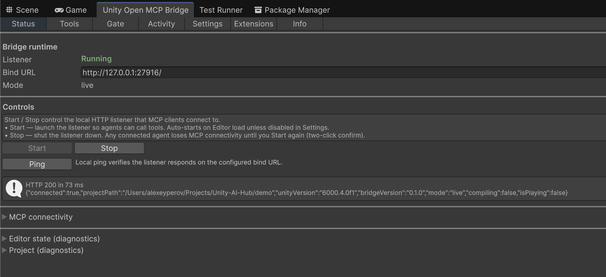
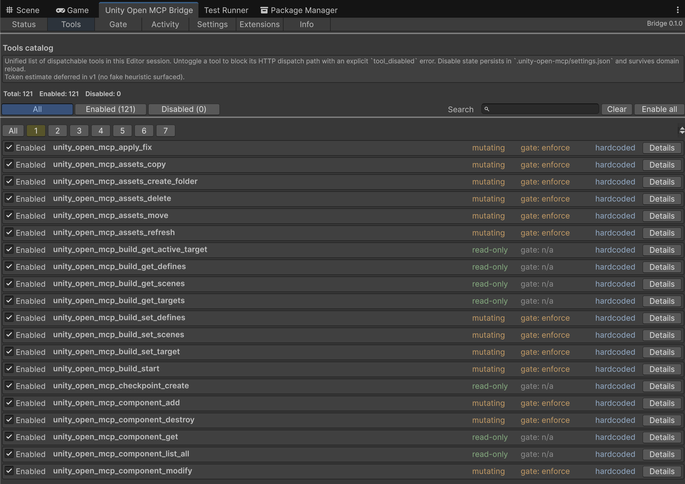

# MCP tools API

`unity-open-mcp` exposes **250+ tools** for Unity editor workflows. This page is
the overview and index; focused pages own session visibility, routing/lifecycle,
and CLI automation.

> **Install / connect.** See [Manual setup](../setup/manual-setup.md) for the
> Unity packages and [MCP client configuration](../setup/client-configuration.md)
> for client paths, snippets, and environment variables.

For exact runtime schemas, call `unity_open_mcp_capabilities`. Source
definitions live in `mcp-server/src/tools/`.

|  |  |
|---|---|

## Focused references

| Document | Owns |
|---|---|
| [Tool groups and session visibility](tool-groups.md) | Default groups, `manage_tools` actions (list/activate/deactivate/reset + intent-driven `suggest`/`activate_for`), availability vs activation, reset/restart, and auto-activation. |
| [Routing, offline, and lifecycle contracts](routing-lifecycle.md) | Live/batch/offline/local selection, offline coverage, lifecycle recovery, batch behavior, errors, and multi-agent scheduling. |
| [CLI and automation](cli-automation.md) | CLI commands, options, JSON output, and links to canonical CI behavior. |
| [CI templates](../ci/README.md) | Pipeline shape, CLI exit codes, baselines, and provider templates. |
| [MCP resources](resources.md) | Resource URIs, payloads, and resource routing. |

## Tool families

- **Core runtime** — ping, C# execution, method invocation, menu calls,
  reflection, compile checks, editor status, and live batch execution.
- **Bridge & Editor recovery** — operator health (`bridge_status`), offline
  compile-error diagnosis (`read_compile_errors`), Editor fd-exhaustion
  recovery (`restart_editor` — requires explicit confirmation, refuses when
  the fd-exhaustion signature is absent), and proactive fd-usage prediction
  (`resource_pressure` — headroom against Mono's ~1024 fd ceiling + leak-trend
  detection). All local-routed; they act on the OS process and survive a dead
  bridge.
- **Gate and validation** — validation, checkpoints, deltas, references,
  dependencies, scans, baselines, regression checks, and targeted fixes.
- **Asset intelligence** — reserialize plus structured asset read/search/list.
- **Agent senses** — tests, screenshots, Frame Debugger, console, profiler,
  memory/rendering snapshots, spatial queries, and event pull.
- **Typed editor** — assets, materials, shaders, prefabs, GameObjects,
  components, scenes, packages, selection, undo, tags/layers, scripts,
  ScriptableObjects, asmdefs, build, and project settings.
- **Embedded domains** — navigation, input, ProBuilder, particles, animation,
  splines, lighting, audio, UI, constraints, terrain, Cinemachine, Timeline,
  Tilemap, Shader Graph, VFX Graph, Memory Profiler, and 2D art.
- **Discovery** — capabilities, rules, skill generation, and tool-group
  management.
- **Unity Hub control** — editor discovery, release listing, installs, modules,
  and install-path management without a running bridge.

The canonical embedded-domain dependency and activation table is
[Extension domains](../extensions.md).

## Example prompts

Natural-language prompts an agent can act on with the tool surface. Prefer
calling `unity_open_mcp_capabilities` and activating the right tool group before
a multi-step workflow. For session groups, see [Tool groups](tool-groups.md).

| Theme | Example prompt |
|---|---|
| Safety gate | Remove the Enemy prefab — but stop and ask for confirmation if the gate preview shows new missing references. |
| Asset intelligence | Find all Prefabs that reference `PlayerController` and summarize inbound dependencies. |
| Offline / recovery | Bridge is offline — show me the latest compile errors from the Editor log. |
| Typed editor | Create scene `Assets/Scenes/Level1.unity`, add a Player cube, and parent a Camera under it. |
| Embedded domains | Activate `cinemachine` and create a follow camera for the Player. |
| Agent senses | Run Play Mode tests for the Combat assembly and capture a Game-view screenshot on failure. |
| Tool groups | Reset tool groups, then activate only `core` and `gate-and-verify`. |
| Batch mutations | In one batch: create ten empty GameObjects named `Enemy_1`…`Enemy_10` under an `Enemies` parent. |
| Verify / CI | Create a verify baseline for this project, then report any new blocking issues since the last baseline. |
| Skills | Install or regenerate the Unity Open MCP skill for Cursor in this project. |
| Power tools | Reflect the fields on `PlayerController` and set `moveSpeed` to 8. |
| Hub control | List installed Unity Editors and show which one this project would launch with. |

These are illustrative starting points, not a complete catalog. Exact tool names
and schemas come from `unity_open_mcp_capabilities`.

## Discover tools programmatically

Call `unity_open_mcp_capabilities` first:

```json
{
  "kind": "tools",
  "include_planned": true
}
```

Important response fields:

- `tools[].name`, `category`, `group`, and `inputSchema`
- `tools[].routePolicy` and `batchCapable`
- `tools[].lifecycle` and optional `lifecycleNote`
- `toolGroups[]` for defaults, activation guidance, and compiled availability
- `routing` for the current routing narrative
- `costHints` for output profiles, page sizes, and recommended tool chains
- `lifecycleBlock` for recovery policy

The response is the authoritative current catalog. Public documentation uses
`250+` instead of a hand-maintained exact total.

## Mutation and gate contract

Mutating tools require a non-empty `paths_hint` scoped to the project assets
they may touch. A live mutation normally runs:

```text
checkpoint → mutate → validate → delta
```

Read `gate.delta`, inline `logs`, and `agentNextSteps` even when the mutation
reports success. Gate modes are:

- `enforce` — fail when validation introduces blocking issues;
- `warn` — report issues without blocking;
- `off` — skip the gate when explicitly supported.

`unity_open_mcp_apply_fix` defaults to `dry_run: true`. Review the preview before
applying. Unsafe fixes require an explicit replacement target. A top-level
non-dry-run fix can restore touched files when application fails or introduces
new enforced errors; non-dry-run fixes are refused inside `batch_execute`
because that rollback snapshot is unavailable there. Applying a fix with
`gate: "off"` commits without rollback protection; the response carries
`rollbackDisabled: true` so the mutation is visible and the asset health must
be verified manually afterward.

Every issue can carry:

- `rootCause` — stable code for programmatic branching;
- `evidence` — instance-specific details;
- `fixCandidates` — available fixes and their safety flags;
- `remediation` — human-readable next action.

Copy `issue_id` verbatim from a scan response when applying a fix.

## Output shaping

Heavy tools share:

- `profile`: `compact` (default), `balanced`, or `full`;
- `page_size` to bound a response;
- `cursor` from the previous `pagination.next_cursor`.

Profile-aware tools include `read_asset`, `search_assets`, `scene_get_data`,
`find_references`, `validate_edit`, `scan_paths`, and `component_get`.
`capabilities.costHints` provides recommended starting page sizes and expected
cost bands.

Legacy `detail` and per-tool caps remain aliases when `page_size` is omitted.
Prefer `profile` plus uniform paging for new callers.

Mutating responses include compact per-call Unity console entries in `logs[]`.
Use `unity_senses_read_console` only when the global console buffer and stack
traces are needed.

## Selected tool contracts

### `unity_open_mcp_batch_execute`

Runs multiple typed tools sequentially in one request to an already-open
Editor. It uses one checkpoint/validation/delta cycle and one undo group.
`commands` and the union `paths_hint` are required; `fail_fast` defaults to
`true`; `gate` defaults to `enforce`. Successful earlier steps are not
automatically rolled back when a later step fails. Nested steps that resolve
to the `restart_then_settle` lifecycle (`scene_open` Single mode, `package_add`
/ `package_remove`, `asmdef_create` / `asmdef_modify`, `build_set_target` /
`build_set_defines`, `settings_set_player`, `reimport_package`) are refused
with `batch_nested_reload_unsafe` — a domain reload or scene switch mid-batch
would silently abort every later step. `batch_execute` itself and `compile_check`
are also refused as nested steps.

A `script_write` step (any `.cs` write) followed later in the same batch by an
import/refresh step (`assets_refresh`, `reimport_package`, `reimport_asset`) is
also refused with `batch_nested_reload_unsafe`: the settle wait runs only once
at the batch level after all steps complete, so a compile kicked off by the
refresh can kill the HTTP response mid-write via a domain reload before the
batch envelope is serialized (surfaced by the client as
`bridge_response_unparsable`). Write the script as a single top-level call, let
it settle, then run the remaining steps in a separate batch.

This is live request batching, not headless Unity fallback. See
[Routing and lifecycle](routing-lifecycle.md).

### Target-selector conventions

The typed tools accept a small, consistent set of target selectors, with
aliases so chaining tools does not require renaming the id field each tool
emits:

| Tool family | Primary selector | Accepted aliases |
| --- | --- | --- |
| `invoke_method` | `object_id` | `instance_id`, `objectId` (what object handles from `scene_snapshot` / `spatial_query` / screenshot emit) |
| `object_get_data` / `object_modify` | `instance_id` | `asset_path` |
| `component_get` / `component_modify` / `component_add` | `path` + `type_name` (singular) | `instance_id` (host GameObject), `component_types` array (first element), `component_instance_id` |
| `component_destroy` | host `instance_id` + `component_types` (array) | `path` + `component_types` (note: takes the **host GameObject** id, not `component_instance_id`) |
| `gameobject_*` | `path` + `parent_path` / `name` | `instance_id` |
| `assets_delete` | `paths` (array) | — |

`instance_id` is the canonical live-instance selector and is preferred. When a
field value is itself an object reference (in `object_modify` / `component_modify`
`fields[].value`), accept `{"path": "..."}`, `{"asset_path": "..."}`,
`{"instance_id": N}`, or null. A scene-hierarchy `path` is resolved through the
hierarchy walker (and `GetComponent(fieldType)` for component-typed fields); a
value that cannot be resolved surfaces a per-field error and is **not** silently
written as null.

Negative instance IDs (e.g. `-4617212`) returned by creator tools
(`gameobject_create`, `ui_canvas_add`) are valid live-instance selectors — pass
them back verbatim to `gameobject_modify` / `component_modify` / `invoke_method`.
If a tool ever reports `GameObject not found (instance_id=0…)`, the id changed
across a domain reload; re-acquire it via `gameobject_find` (by name) and retry.

#### `invoke_method` positional arguments

`invoke_method` converts `args[]` JSON values to the method's parameter types.
Beyond scalar types, it resolves:

- **`UnityEngine.Object` / `GameObject` / `Component` parameters** — pass a bare
  integer instance id, or a handle/selector object: `{"instance_id": N}`,
  `{"objectId": N}`, `{"path": "Root/Child"}`, or `{"name": "Child"}`.
- **`Scene` parameters** (e.g. `SceneManager.SetActiveScene(Scene)`,
  `MoveGameObjectToScene(GameObject, Scene)`) — pass `{"path": "Assets/Scenes/X.unity"}`,
  `{"scene_path": "..."}`, or `{"scene_name": "X"}`. The scene must be loaded
  first (`scene_open` Additive); an unloaded scene surfaces a clear
  `invocation_error`.
- **`Vector2` / `Vector3` / `Vector4` / `Color` / `Quaternion`** — pass a string
  array form (`"[1,2,3]"`) or object form (`"{x:1,y:2,z:3}"`).

### `unity_senses_run_tests`

Results are retrieved by the server polling a results file under
`~/.unity-open-mcp/`, **not** via `unity_senses_pull_events` (which streams only
console/editor-state). `timeout_ms` is a client-side polling budget, not a
bridge parameter. When the filter matches zero tests, `TestRunnerApi.Execute`
runs nothing and the result carries `status: "completed"` with
`summary.total: 0` and a `note` — this looks like "no results" but is a no-match
filter, not a failure (`test_class` maps to NUnit `groupNames`, a partial/group
match). To run a single test method deterministically, invoke the test class or
method directly via `unity_open_mcp_invoke_method` — NUnit assertion failures
come back verbatim in the error.

### `unity_open_mcp_manage_tools`

Activation is **additive** (activating one group never drops another). After
`activate` / `activate_for` the server emits `notifications/tools/list_changed`,
but newly-activated tools only appear in your tool list if your client honors
that notification and re-issues `tools/list`. If the tools do not show up,
manually re-request the tool list, or route the tool by id through
`batch_execute` (which works regardless of `listChanged` support).

### `unity_open_mcp_read_compile_errors`

Resolves the authoritative `Editor.log` per platform (project-relative on Unity
6000.5+, global elsewhere). When a live editor holds the project (known from the
instance lock) and the resolved log looks frozen (implausibly small — the
signature of a batch spawn that rotated `Editor.log` to `Editor-prev.log` while
the live editor keeps writing to the rotated file), it falls back to
`Editor-prev.log` and reports `logSource: "prev_log_live_editor"` in the
response. When an assembly is stuck in a failed-compile state,
`AssetDatabase.Refresh` no-ops and the response carries `staleLogSuspected` —
force a recompile (`reimport_package` / `compile_check`) before trusting the
errors. `compile_check` itself short-circuits with `editor_instance_locked`
**before** spawning when a live editor holds the project, avoiding the spawn
that would rotate the log in the first place.

The response also carries `staleAssembly: true` when at least one
`Assets/**/*.cs` source is newer than the newest `Library/ScriptAssemblies/*.dll`
— the running assembly predates the latest source (Unity's incremental compiler
no-op'd a recompile), so a `no_errors_found` signal **cannot** be trusted until
the assembly is rebuilt. Call `unity_open_mcp_recompile_scripts`, then re-read
compile errors.

### `unity_open_mcp_recompile_scripts`

A deterministic "force a real recompile and wait for it" primitive. Calls
`CompilationPipeline.RequestScriptCompilation` (or the internal
`EditorUtility.RequestScriptCompilation` on older Unity) and blocks until the
compile settles via its `restart_then_settle` lifecycle. Use this when
`assets_refresh` / `execute_csharp` fail to recompile after a C# edit — Unity's
incremental compiler frequently no-ops on unchanged-import views, leaving the
running assembly stale. The response reports `dllMtimeBefore` / `dllMtimeAfter`
(newest `Library/ScriptAssemblies/*.dll` mtime, UTC ticks) and a `recompiled`
boolean so a no-op is detectable; `agentNextSteps` branches on the outcome
(`read_compile_errors` when rebuilt, poll `isCompiling` when a compile was
already in flight, fall back to `assets_refresh` / `reimport_package` when Unity
judged sources unchanged). The recompile is project-wide; `paths_hint` exists
only to give the gate a scoped hint (the edited scripts).

### Creator tools and scene targeting

`gameobject_create`, `ui_canvas_add`, and `prefab_instantiate` accept an optional
`scene_path` / `scene_name` to control which **loaded** scene receives the new
root GameObject / Canvas / instance. Without it, the new object lands in the
active scene — invisible and mutable, so with multiple scenes loaded the result
was inconsistent. Pass the target scene asset path (e.g.
`Assets/Scenes/Bootstrap.unity`) or name; the scene must already be loaded
(`scene_open` Additive first). `ui_canvas_add`'s EventSystem ensure is scoped to
that scene, so a stray EventSystem is neither created in nor stolen from a
different loaded scene.

### `unity_open_mcp_editor_status`

In addition to play/compile/pause state and the active scene path, reports
`dirtySceneCount` + `dirtyScenes: [{name, path}]` — every loaded scene with
unsaved in-memory changes. This is the memory-vs-disk signal: after a structural
op (`gameobject_set_parent`) that marks a scene dirty without writing it, check
`dirtySceneCount > 0` to know a `scene_save` is pending before reasoning against
on-disk YAML. `reserialize` reports `touchedOpenScenes` and marks opened scenes
dirty when it rewrites their on-disk YAML, for the same reason.

### `unity_open_mcp_dependencies`

Returns forward and reverse asset edges, broken forward GUIDs, and dependency
cycles. Use `include_impact=true` for the transitive reverse closure. The impact
closure is offline-routed; other forms prefer live Unity and fall back where
supported.

### Scene tools

`scene_set_active`, `scene_unload`, `scene_save`, and `scene_get_data` resolve
opened scenes by asset `path` first and display `name` second. Prefer paths.
For `scene_save`, a path that does not identify an open scene is a save-as
destination.

### `unity_open_mcp_component_get`

Reads serialized fields/properties of one Component. The optional `fields`
array filters the response to entries whose leaf path/name matches (exact,
case-insensitive on the last path segment), bypassing `page_size`/`cursor` and
the `max_fields` cap — ask for one field on a 126-field component without
paging. Containers and arrays that the SerializedProperty leaf reader does not
expand render as `{"note":"container_or_array","hint":"use 'property_path' to
drill in, or 'object_get_data' to expand"}`; drill in via `property_path`, or
use `object_get_data` to expand the same array reflectively.

### `gameobject_modify`

In addition to legacy flat fields, the tool accepts:

- `gameObjectDiffs` for the target root;
- `pathPatchesPerGameObject` for descendants;
- `jsonPatchesPerGameObject` for component merge patches.

Application order is component JSON patches, descendant path patches, then
root diffs.

### Unity Hub control

The `unity_open_mcp_hub_*` family is local-routed and does not need a running
Editor. Install calls open Unity Hub through its deep link and return after the
request is accepted, not after download completion. Poll `hub_list_editors` to
confirm completion. System-level mutations are gate-free because they do not
modify project assets.

## Source references

- `mcp-server/src/tools/index.ts`
- `mcp-server/src/tool-router.ts`
- `mcp-server/src/batch-spawn.ts`
- `mcp-server/src/compressible-router.ts`
- `mcp-server/src/capabilities/build-capabilities.ts`
- `mcp-server/src/capabilities/tool-groups.ts`
- `mcp-server/src/tool-session-state.ts`
- `mcp-server/src/cli/`
