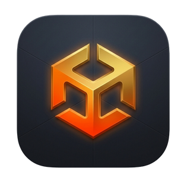
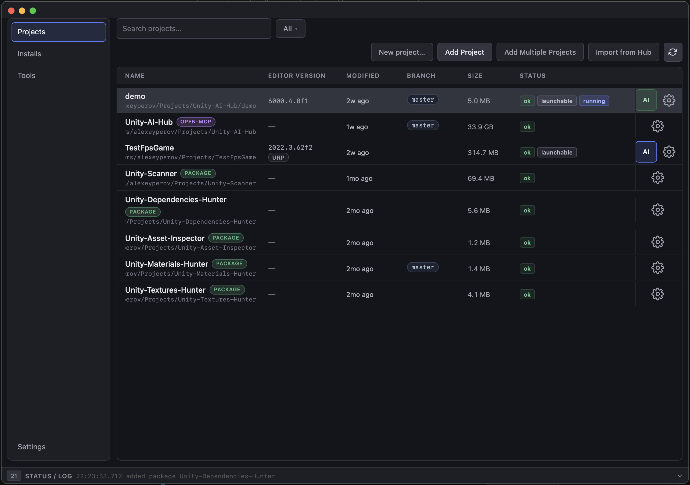
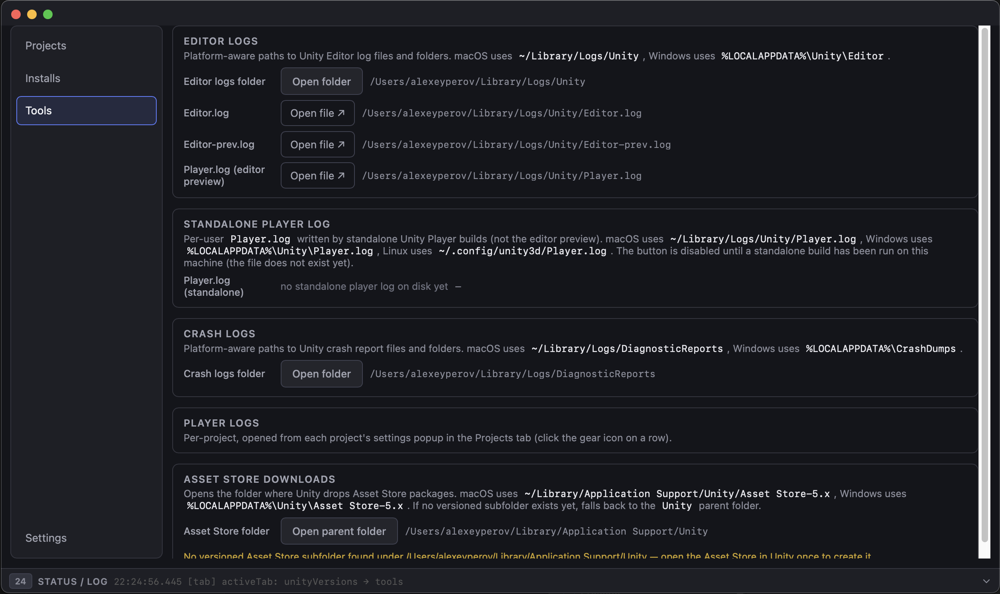
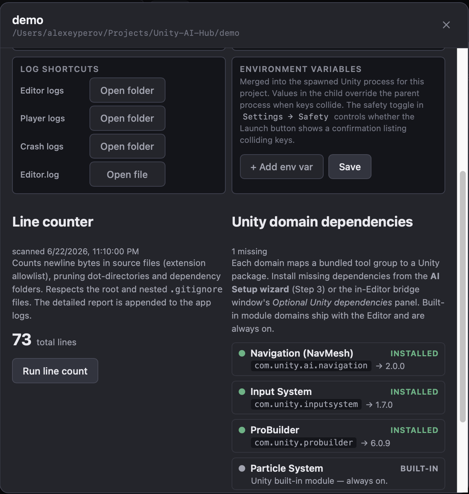
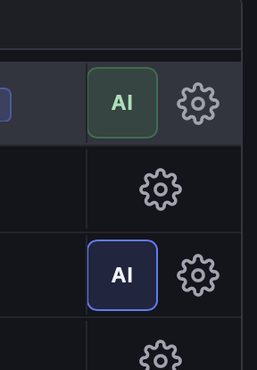

<p align="center">
  
</p>

# Unity Hub Pro

Unity Hub Pro is the optional desktop companion app for Unity Open MCP. It helps
you manage projects, run the AI Setup wizard, and handle maintainer workflows
from one UI.

> **You do not need the Hub to use Unity Open MCP.** The manual path in
> [Manual setup](setup/manual-setup.md) works with no extra app. The Hub just automates
> the fiddly parts — editing `Packages/manifest.json`, writing the MCP-client
> config, copying the agent skill — so you don't have to touch a text editor or a
> terminal. If you're new to Node, MCP clients, or JSON config files, start here.

## Who is this for

- **Artists and designers** who want to prototype with AI but don't want to edit
  JSON or run terminal commands.
- **Unity developers who haven't used Node/npm before** — the wizard handles the
  server side for you and explains what it's doing.
- **Anyone maintaining an Open MCP checkout** — the maintainer panel runs build,
  test, version bump, and publish actions from a UI.

## What it does

- Adds and classifies folders as Unity projects, Open MCP repositories, packages, or custom entries.
- Runs the AI Setup wizard for MCP onboarding and verification.
- Manages per-project launch options and environment variables.
- Shows git status and line-count views in project settings.
- Provides maintainer actions for Open MCP repositories (build, test, version bump, publish dry-run, publish).
- Checks the Hub's own `hub-v*` release line after startup and offers an
  explicit, non-blocking update action when a newer installer is available.

| Projects                            | Tools                                |
|------------------------------------------|-------------------------------------------------|
|  |  |

## Main workflows

### 1) Project management

- Add projects from disk.
- Open project-specific settings.
- Launch Unity with per-project configuration.



### 2) AI setup

- Click the **AI** action on a Unity project row.
- Follow wizard steps for packages, MCP client config, and verification.
- Re-run verification when Unity or dependencies change.



For full setup steps, see [wizard-setup.md](setup/wizard-setup.md).

### 3) Maintainer panel (Open MCP repositories)

- Run `npm run build` and `npm test` from the `mcp-server/` workspace.
- Bump package version.
- Run publish dry-run and publish with confirmation.
- Run the repo-wide version sync (`sync-version.mjs`): sync, drift-check,
  bump, or set the version for either the shared trio (npm server + bridge
  + verify) or the Hub app itself. This is the release/drift tool — distinct
  from the package-only version bump above; the Hub never creates git tags.

## Installation

Unity Hub Pro ships as pre-built installers — you do **not** need Node, npm, or
any build toolchain to run it. Grab the latest release for your operating system:

> **Download:** [Unity Hub Pro releases](https://github.com/AlexeyPerov/Unity-Open-MCP/releases)
> — look for the latest **`hub-v*`** tag.

### macOS

1. Download the `.dmg` (pick the **macOS ARM** build on Apple Silicon, or **macOS x64** on Intel).
2. Open the `.dmg` and drag **Unity Hub Pro** to your **Applications** folder.
3. On first launch, macOS may block the app because it isn't from the App Store.
   Right-click the app → **Open** → confirm in the dialog. You only need to do
   this once. (If Gatekeeper still refuses: **System Settings → Privacy &
   Security → Open Anyway**.)

### Windows

1. Download the **Windows x64** build — either the `.msi` installer or the
   `-setup.exe`.
2. Run it. SmartScreen may warn about an unrecognized publisher; choose
   **More info → Run anyway**.
3. Launch **Unity Hub Pro** from the Start menu.

### Verifying it works

Open the app and add a Unity project from disk — it should appear in the project
list. Click the **AI** action on that row to start the wizard (see
[wizard-setup.md](setup/wizard-setup.md)).

## Hub updates

Official release builds check GitHub Releases after the main window is ready.
Checks are limited to once per hour, including failed attempts, and a cached
newer release remains visible while GitHub is unavailable. Development and
locally-built binaries do not make this request.

When a newer `hub-v*` release exists, a non-modal banner offers:

- **Update** — downloads the installer for the current OS and CPU, then opens
  the platform installer. On macOS, replace the app from the opened disk image;
  on Windows, finish the launched setup program. Relaunch the Hub afterward.
- **Release notes** — opens the matching GitHub Release.
- **Remind later** — hides the notice for 24 hours.
- **Dismiss** — hides that release; a later version appears normally.

An update never changes MCP client configuration, Unity package pins, or any
project files. Those components have an independent release cadence; see
[Version compatibility](versioning.md). If download or installer launch fails,
use the release-page link in the error state and install manually.

The current release pipeline publishes ordinary HTTPS-hosted GitHub installers,
not a checksum manifest or signed Tauri updater bundle. The Hub therefore hands
off replacement and rollback to the operating-system installer and does not
claim an install succeeded merely because the download completed. Adding
cryptographically signed updater bundles is a release-pipeline follow-up; the
app never applies an update silently.

## For developers (build from source)

If you want to build the Hub yourself — to run a local modification or debug —
you need Node and Rust. From `hub/`:

```bash
npm install
npm run tauri dev
```

For implementation-level details, see [`hub/README.md`](../hub/README.md).
