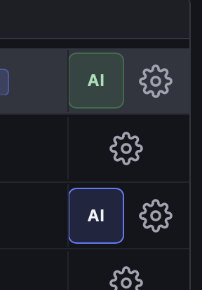
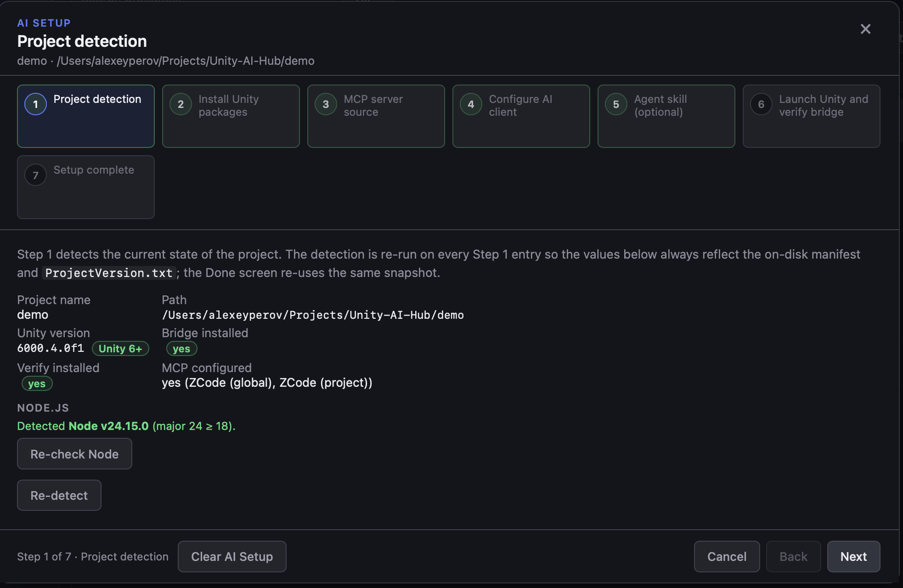
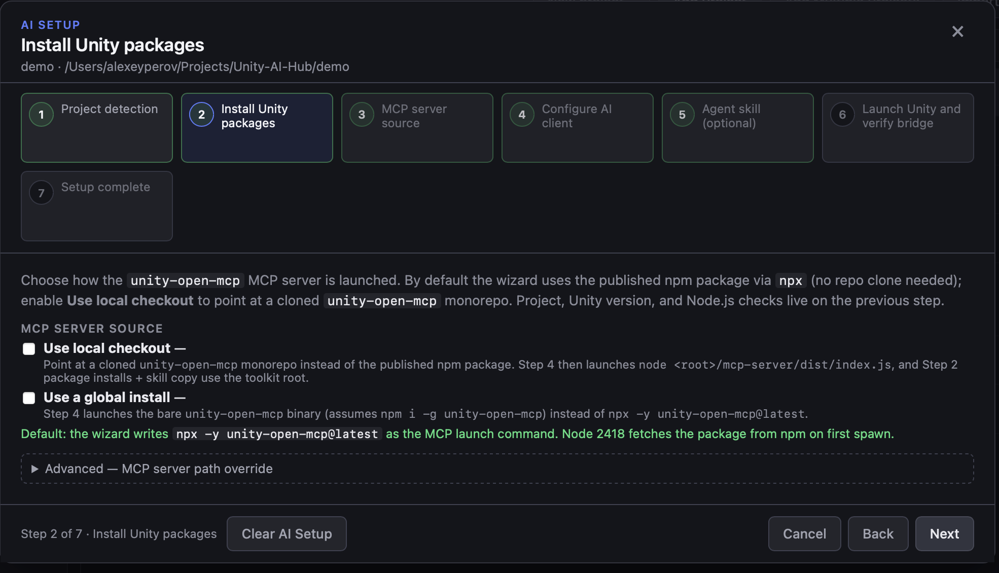
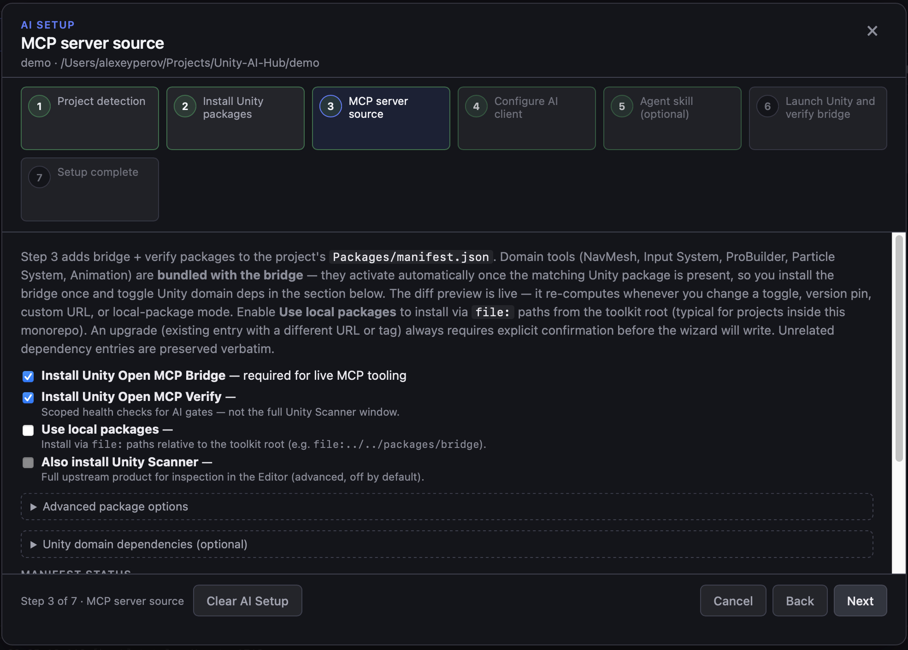
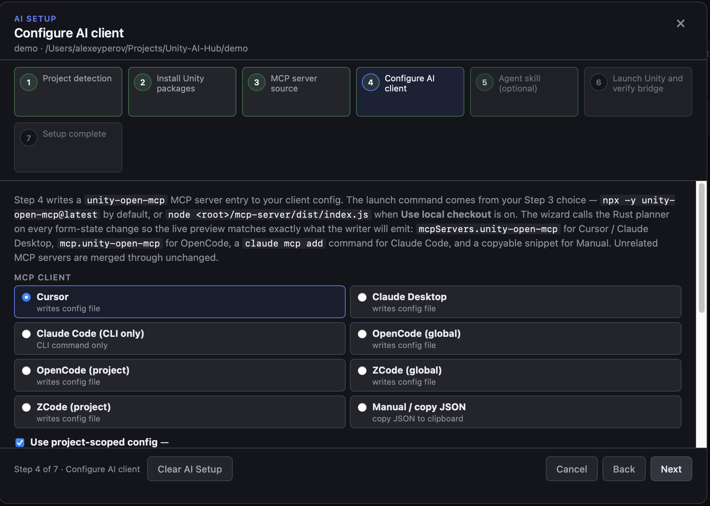
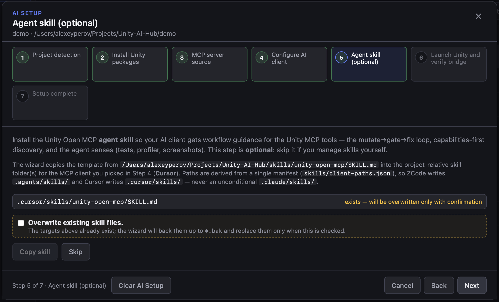
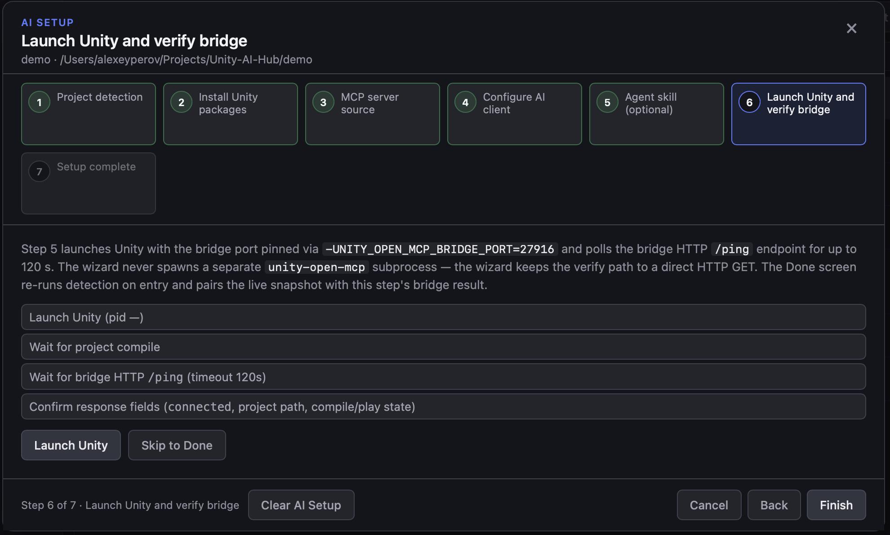

[English](../../setup/wizard-setup.md) · 简体中文

# 向导安装（Unity Hub Pro）

本文说明如何通过 Unity Hub Pro 安装 Unity Open MCP。

## 适用人群

这是无需终端、无需手工编辑 JSON、无需 Git URL 的安装方式。也就是说，如果你不想打开命令行，请用这篇指南。

自助路径（不使用 Hub 应用）见 [manual-setup.md](manual-setup.md)。
想让 AI 智能体代为安装？见 [agent-setup.md](agent-setup.md)。

## 环境要求

- **Unity 2022.3 LTS 或更高版本**（推荐 Unity 6）。
- **Node.js 18 或更高版本** — 之所以需要，仅因为 MCP 服务器是一个小型 Node 程序。如果你没有，从
  <https://nodejs.org/> 安装（点 **LTS** 按钮）。向导会检查它，并在缺失或过旧时告诉你。
- **Unity Hub Pro** — 先安装它。见 [unity-hub-pro.md](../../unity-hub-pro.md)
  （从 GitHub Releases 页面下载你操作系统的安装包）。
- **一个 MCP 客户端**（Cursor、Claude Desktop、Claude Code、OpenCode、ZCode、Cline、Codex、VS Code Copilot、Gemini CLI，或其他受支持的智能体） — 你实际用来驱动 Unity 的 AI 工具。

## 总体流程

1. 如未安装，先**安装 Unity Hub Pro**（见 [unity-hub-pro.md](../../unity-hub-pro.md)）。
2. 打开 Unity Hub Pro 并添加你的 Unity 项目。
3. 点击该项目的 **AI** 操作。当该项目已安装并配置好智能体时，按钮变为**绿色**；否则呈琥珀色/蓝色并打开向导。
4. 在预设步骤选择一个预设（或选 **Custom / skip**）。
5. 完成向导 — Recommended 预设可通过 **Express setup** 一键完成全部。
6. 重启 MCP 客户端。
7. 运行一次 Unity MCP 调用以确认连接。

向导的选择（预设、MCP 客户端、包开关、bridge 端口以及其他表单字段）按**项目**记忆，重新打开向导时总是从预设选择器重新开始。



## 向导步骤

向导顶部显示可点击的进度条。当某段的检查已通过时，该段变为**绿色**，便于一眼看出哪些步骤仍需处理。你可以点击任意段落跳转到该步骤；Back/Next 仍按顺序移动。推荐路径在任何步骤都不需要展开 **Advanced (optional)**。

### Preset — 安装预设（可选）

选择一个预设以预填向导其余部分，或选 **Custom / skip** 手动配置每一步。预设只是起点而非锁定 — 你可以在后续步骤修改任意字段。首屏显示三个常用选项；小众预设位于 **More presets** 之后。

| 预设 | 最适合 | 预填内容 |
|---|---|---|
| **Regular user (npm)** *(推荐)* | 想使用已发布 npm 包、不检出 monorepo 的开发者 | `npx -y unity-open-mcp@0.7.0`；bridge + verify 来自已发布源；领域依赖关闭；技能开启 |
| **Contributor (local checkout)** | 在 bridge / verify / MCP 服务器上改动的 monorepo 贡献者 | 本地检出 + 克隆中的 `file:` 包；领域依赖关闭；技能开启。先构建 `mcp-server/`（见 [开发安装](development-setup.md)） |
| **Custom / skip** | 想用向导内置默认值的任何人 | 无预填 — 与手动流程相同 |

**More presets**（折叠展开后）：

| 预设 | 最适合 | 预填内容 |
|---|---|---|
| **Team CI** | 无头 CI 自动化 | 全局 npm 安装；**Manual / CLI snippet** 客户端；跳过技能；在 bridge 上为 CI 配置令牌认证 |
| **Secure / remote** | 限制变更的非 localhost bridge 访问 | 已发布源；技能开启。令牌认证、远程绑定与受限工具组是 bridge 侧的控件 — 接入后从 bridge 窗口配置 |

### Preflight — 环境闸门

预检检查你的环境，是其他一切的前置闸门。检查分为两组：

- **Blocking（阻塞）— 必须通过才能继续：** 合法的 Unity 项目布局、Unity 版本（最低 2022.3 LTS；推荐 Unity 6+）、Node.js 18+，以及可写的 `Packages/manifest.json`。这些必须全部通过，Next 才会启用。
- **Setup status（安装状态）— 在后续步骤处理：** bridge / verify 包、某个 MCP 客户端配置以及智能体技能是否已安装。这些显示为“Not yet”（不作为失败），并随着你完成后续步骤而变绿。

一个 **Re-check** 按钮可重新运行项目检测和 Node 探测。检测与 Node 探测在 UI 线程之外运行并受超时限制，因此缓慢的磁盘或挂起的 `node --version` 会作为真实错误呈现，而不会冻结向导。你随时可以用 **Cancel**、**Escape** 或 **×** 按钮关闭向导 — 检测会在后台停止。

**已经配置过了？** 如果 bridge、verify 和某个 MCP 客户端都已为该项目配置好，Preflight 会显示 **You're ready** 横幅，并提供 **Go to Verify** 快捷方式以跳过应用步骤。

**Express setup：** 当环境检查通过时，Preflight 会提供 **Express setup** — 一次 **Set up** 点击即依次完成包安装 → MCP 客户端写入 → 启动/校验，并附带实时进度列表。完整的逐步路径仍可通过进度条访问。



### MCP server source（可选 / 高级）

选择 `unity-open-mcp` 服务器的启动方式。默认（`npx`）无需在此配置，向导在 Recommended 路径上会自动跳过此步骤 — 你只会在通过进度条或 **Custom / skip** / **Contributor** 预设时才到达这里。

- **npx (published npm)** *(默认)* — 首次启动时从 npm 拉取最新 `unity-open-mcp`。无需克隆仓库。
- **Global install** — 启动裸 `unity-open-mcp` 可执行文件（假设 `npm i -g unity-open-mcp`）。适合 CI 镜像的稳定路径。
- **Local checkout** — 指向一个克隆的 `unity-open-mcp` monorepo。包与技能复制使用工具包根目录。
- **Custom entrypoint (advanced)** — 指向工具包根目录之外的某个 `mcp-server/dist/index.js` 路径。

选择一种来源；仅显示该选择对应的输入项。Local checkout 和 custom entrypoint 都需要经过校验的工具包根目录。如果使用 local checkout，请先构建：

```bash
cd mcp-server
npm install
npm run build
```



### Unity packages

在 `Packages/manifest.json` 中安装或升级 bridge 和 verify 包。必选开关位于默认区；实时差异预览会随你的改动重新计算。

**Advanced (optional)**（默认折叠 — 推荐路径永远不需要）：

- **Use local packages** — 通过相对于工具包根目录的 `file:` 路径安装（典型用于 monorepo 内部的项目）。
- **Package version pin** — 覆盖两个包共同锁定的标签。留空则安装与本 Hub 构建匹配的版本。
- **Custom git URL** — 替换工具包根目录的 git 远程地址（用于针对某个 fork 测试）。
- **Unity domain dependencies (optional)** — NavMesh、Input System、ProBuilder。领域工具**随 bridge 打包**；一旦匹配的 Unity 包存在，它们会自动编译进来。勾选你想让向导添加的那些。内置模块（Particle System、Animation）随编辑器提供，无需清单条目。

接入后，你可以随时从 bridge 窗口（**Tools → Unity Open MCP Bridge → Extensions → Optional Unity dependencies**）增删 Unity 领域依赖 — 每个领域一键，无需编辑清单。Hub 的项目设置弹窗也会显示每个领域只读的已安装/缺失状态。

关于贡献者 / 社区包的 `file:` 工作流，见 [开发安装](development-setup.md)。



### Configure AI client

选择要连接的 AI 客户端。首屏显示简短的 **Popular** 列表（Cursor、Claude Desktop、VS Code Copilot、Claude Code、Manual）；完整目录在 **Show all clients** 之后，带搜索框。

每个选项都显示它是写入配置文件、仅 CLI，还是复制片段，并在其工具提示里给出目标路径与格式。完整的路径与配置结构目录见
[MCP 客户端配置](client-configuration.md)。

审阅生成的配置预览（JSON 或 TOML，或 Claude Code 的 CLI 命令），然后写入。写入是合并安全的：无关键和其他 MCP 服务器会被保留，并在原文件旁留下一份 `.bak` 备份。

**Advanced (optional)：** **Bridge HTTP port** 覆盖位于此处（默认折叠；端口会从项目路径自动推导）。



### Agent skill（可选）

智能体技能为你的 AI 客户端提供 Unity MCP 工具的工作流指引 — mutate→gate→fix 循环、capabilities 优先发现，以及智能体感知（测试、profiler、截图）。有两个选项写入你所选客户端的同一个项目级技能文件夹（ZCode → `.agents/skills/`，Cursor → `.cursor/skills/` 等）：

- **Copy skill** — 安装模板操作手册（`skills/unity-open-mcp/SKILL.md`）。适用于每个项目的同一份工作流指引；无需构建。
- **Generate project skill** — 生成项目专属的 `SKILL.md`，将模板操作手册与本项目的清单（Unity 版本、已安装的包、关键 MonoBehaviour / ScriptableObject 类型）合并。需要已构建的 MCP 服务器（`mcp-server/dist/index.js`）。

两者都遵循一个显式的覆盖勾选框；现有文件在被替换前会备份为 `*.bak`。你可以只复制、只生成，或两者都做（生成会覆盖复制写入的同一路径，因此请确认覆盖）。

**Team CI** 预设会自动跳过此步骤 — CI 智能体通常不需要桌面技能文件。



### Launch and verify

- 启动 Unity
- 等待编译完成与 bridge 就绪
- 健康检查通过后结束

等待期间，MCP 服务器会按照 `UNITY_OPEN_MCP_DIALOG_POLICY` 自动关闭常见的 Unity 启动模态框（Safe Mode、版本不匹配等）。如果此步骤卡在某个模态框上，见 [对话框策略](../../dialog-policy.md)。



## Clear AI Setup

向导页脚有一个黄色的 **Clear AI Setup** 按钮（右下角）。在确认提示后，它会移除向导为当前项目写入的所有产物：

- `Packages/manifest.json` 中的 bridge + verify 条目
- 每个已知 MCP 客户端配置中的 `unity-open-mcp` 条目（项目级配置无条件移除；全局配置仅移除项目路径匹配本项目的那个条目）
- 复制的智能体技能 `SKILL.md` 文件

每个被改动的文件旁都会创建 `.bak` 备份。按目标的失败会内联报告，而不会中止整个流程。此操作无法撤销。

## 故障排查

在继续之前，先解决所有阻塞型 Preflight 检查。安装完成后，重启客户端、确认 Unity 启动了所选项目并等待编译完成。**Re-check** 刷新磁盘上的安装状态；bridge 可达性仅在 Launch and verify 期间测试。连接与恢复流程请使用
[故障排查](../../troubleshooting.md)；启动模态框请使用
[对话框策略](../../dialog-policy.md)。

## 相关文档

- [对话框策略](../../dialog-policy.md)
- [MCP 客户端配置](client-configuration.md)
- [Agent 安装](agent-setup.md)
- [手动安装](manual-setup.md)
- [Unity Hub Pro](../../unity-hub-pro.md)
- [Bridge HTTP API](../../api/bridge-http.md)
- [MCP 工具 API](../../api/mcp-tools.md)
