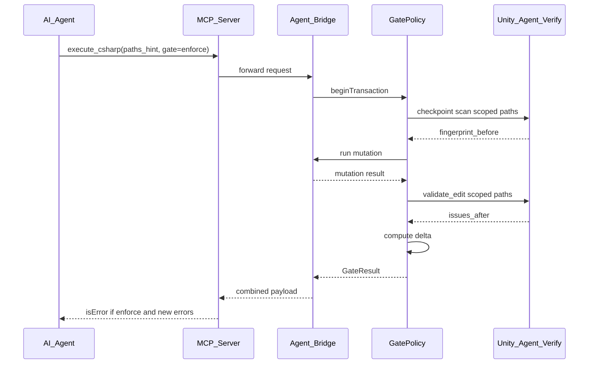
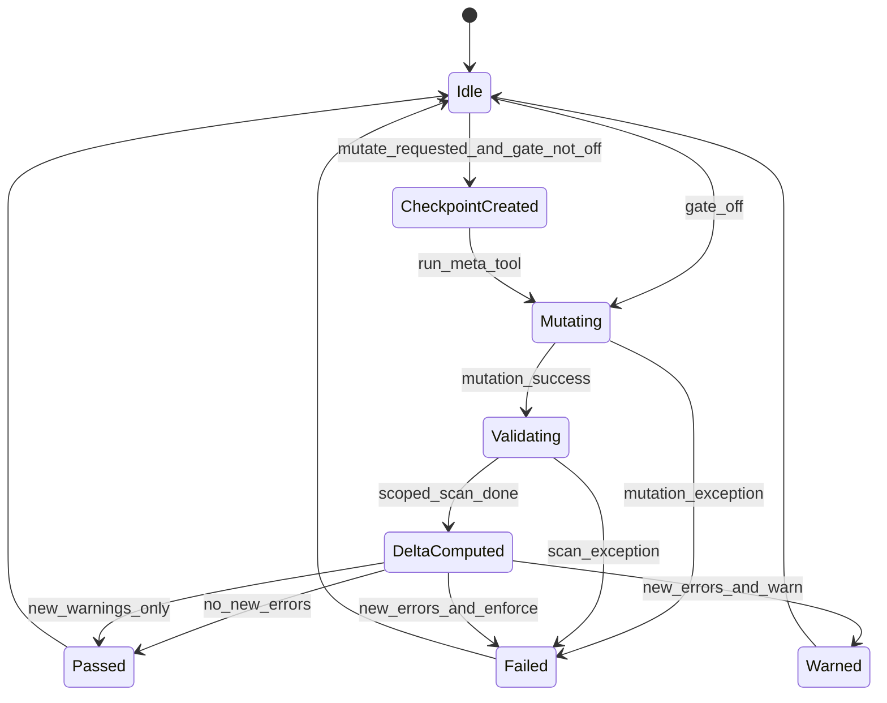

# GatePolicy

GatePolicy is the core differentiator of Unity Agent Bridge: **every mutating meta-tool is wrapped in a verify envelope** so agents learn immediately when a change broke the project.

Principle: **mutation success ≠ project safe.**

See also: [mcp-tools.md](mcp-tools.md), [../packages/verify.md](../packages/verify.md), [../packages/bridge.md](../packages/bridge.md).

## Overview



## State machine



### States

| State | Description |
|---|---|
| **Idle** | No active transaction |
| **CheckpointCreated** | Pre-mutation fingerprint stored |
| **Mutating** | Meta-tool executing on main thread |
| **Validating** | Post-mutation scoped verify run |
| **DeltaComputed** | Before/after comparison complete |
| **Passed** | Gate satisfied; MCP success |
| **Failed** | Gate or mutation failed; MCP `isError: true` (if enforce) |
| **Warned** | Issues found but `gate: warn`; MCP success with warnings |

## Gate modes

| Mode | Default? | Checkpoint | Validate | Delta | MCP `isError` on new errors |
|---|---|---|---|---|---|
| `enforce` | yes | yes | yes | yes | yes |
| `warn` | | yes | yes | yes | no |
| `off` | | no | no | no | only on mutation failure |

### When to use each mode

- **`enforce`** — interactive agent loops; default for all mutating tools.
- **`warn`** — exploratory changes; agent reads `gate.delta` but is not blocked.
- **`off`** — trusted scripts, performance-critical paths, or debugging (requires explicit opt-in).

## Transaction lifecycle

### 1. Begin transaction

Triggered automatically when a mutating tool is called with `gate != off`.

Inputs:
- `paths_hint[]` from tool arguments (agent-declared)
- `inferred_paths[]` from bridge (optional: last imported assets, saved paths)

If `paths_hint` is empty, bridge returns `paths_hint_required` error (M2 strict mode — no fallback). Agents must always provide explicit asset paths for mutating operations.

### 2. Create checkpoint

Lightweight scoped scan — **not** a full 21-category run.

**Checkpoint record:**

```json
{
  "checkpointId": "cp_8f3a2b",
  "timestamp": "2026-06-07T12:00:00Z",
  "label": null,
  "paths": ["Assets/Prefabs/Player.prefab"],
  "categories": ["missing_references", "scene_prefab_health"],
  "fingerprint": {
    "missing_references": {
      "errors": 0,
      "warnings": 1,
      "issueKeys": ["missing_references|WARN|Assets/Other.prefab|EMPTY_REF"]
    },
    "scene_prefab_health": {
      "errors": 0,
      "warnings": 0,
      "issueKeys": []
    }
  },
  "fileHashes": {
    "Assets/Prefabs/Player.prefab": "sha256:abc..."
  }
}
```

**Issue key format:** `{categoryId}|{severity}|{assetPath}|{issueCode}` — stable identity for delta.

### 3. Mutate

Run the meta-tool on the Unity main thread:
- `execute_csharp`
- `invoke_method`
- `execute_menu`
- `apply_fix` (when not `dry_run`)

Capture:
- `success`, `output`, `error`, `durationMs`
- `touchedPaths[]` if mutation reports them

### 4. Validate

Run `validate_edit` equivalent internally:
- Same `paths` as checkpoint (union with `touchedPaths`)
- Same `categories` (see mapping table below)
- Produce `issues_after[]`

### 5. Compute delta

```text
newIssues     = issues_after  - fingerprint.issueKeys (by key)
resolvedIssues = fingerprint.issueKeys - issues_after (by key)
```

**Summary counts:**

```text
newErrors      = count(newIssues where severity == Error)
newWarnings    = count(newIssues where severity == Warning)
resolvedErrors = count(resolvedIssues where severity == Error)
```

### 6. Pass / fail

| Condition | `enforce` | `warn` |
|---|---|---|
| Mutation threw | Failed | Failed |
| `newErrors > 0` | Failed | Warned |
| `newWarnings > 0` only | Passed | Warned |
| No new issues | Passed | Passed |

## Rule selection by path type

Auto-selected when `categories` not specified (verify rule IDs):

| Path pattern | Verify rules |
|---|---|
| `*.prefab`, `*.unity` | `missing_references`, `scene_prefab_health` |
| `*.cs`, `*.asmdef` | `missing_references`, `asmdef_audit` |
| `*.mat`, `*.shader`, `*.shadergraph` | `missing_references`, `materials`, `shader_analysis` |
| `*.png`, `*.jpg`, `*.tga`, SpriteAtlases | `textures`, `sprite_2d_analysis` |
| `*.controller`, `*.anim` | `animation_analysis`, `missing_references` |
| `*.wav`, `*.mp3`, `*.ogg` | `audio_analysis` |
| Addressables paths / groups | `addressables` (if build layout configured) |
| Unknown / mixed | `missing_references`, `project_health` (minimal safe set) |

Agents can override with explicit `categories` in `validate_edit` or `paths_hint` workflows.

## MCP response contract

### Full payload (always returned)

```json
{
  "mutation": {
    "success": true,
    "output": {},
    "error": null,
    "durationMs": 120
  },
  "gate": {
    "mode": "enforce",
    "checkpointId": "cp_8f3a2b",
    "skipped": false,
    "validation": {
      "passed": false,
      "issues": [],
      "categoriesRun": ["missing_references", "scene_prefab_health"],
      "durationMs": 450
    },
    "delta": {
      "newErrors": 1,
      "newWarnings": 0,
      "resolvedErrors": 0,
      "resolvedWarnings": 0,
      "newIssues": [],
      "resolvedIssues": []
    }
  },
  "agentNextSteps": [
    "Inspect newIssues[0]: MISSING_SCRIPT on Assets/Prefabs/Player.prefab",
    "Consider unity_agent_apply_fix with fix_id remove_missing_script (dry_run first)"
  ]
}
```

### `isError` rules (MCP server)

Set `isError: true` when:

```text
(mutation.success == false)
OR
(gate.mode == "enforce" AND gate.delta.newErrors > 0)
```

Set `isError: false` but include warnings when:

```text
gate.mode == "warn" AND gate.delta.newErrors > 0
```

When `gate.mode == off`:

```text
isError = (mutation.success == false) only
```

### `agentNextSteps` generation (heuristic)

Bridge populates 1–3 short strings:
- Top new error description + asset path
- Matching `fixId` if `fixSafe == true`
- Suggest `unity_agent_delta` or re-run after fix

## Session storage

### Live bridge (in-memory)

- Ring buffer of last N checkpoints (default N = 20) keyed by `checkpointId`.
- Current session ID in bridge status.

### Optional persistence

Write to `{project}/.unity-agent/checkpoints/{checkpointId}.json`:
- Enables Hub to show history
- Enables CI local comparison
- Gitignored by default (template in `.gitignore` suggestions)

## Security policy (future)

### Execute / invoke deny-list (sketch)

Block or require `gate: off` + explicit flag:
- `System.IO.File.Delete`, `Directory.Delete` on `Assets/`
- `UnityEditor.AssetDatabase.DeleteAsset` bulk without path scope
- `EditorApplication.Exit`
- `BuildPipeline.BuildPlayer` without `confirm_build: true`
- Package Manager remove/add (optional warn-only)

### Menu deny-list

- `File/Quit`
- Menus that open modal dialogs without auto-dismiss (batch unsafe)

### Fix application

- `apply_fix` defaults `dry_run: true`
- Only `fixSafe: true` fixes allowed under `enforce` without extra confirmation

## Agent workflow examples

### Example A — prefab edit caught

1. Agent calls `execute_csharp` to add component, `paths_hint: ["Assets/Prefabs/Player.prefab"]`.
2. C# runs successfully.
3. Gate finds new `MISSING_SCRIPT` error (bad script GUID).
4. MCP returns `isError: true` with `agentNextSteps`.
5. Agent fixes script reference, retries.
6. Delta shows `resolvedErrors: 1` → pass.

### Example B — warn mode exploration

1. Agent uses `gate: "warn"` while prototyping shader changes.
2. New warnings appear in `gate.delta` but MCP succeeds.
3. Agent reads warnings, decides to fix before commit.
4. Agent calls `unity_agent_validate_edit` with `gate` N/A before PR.

### Example C — manual checkpoint

1. Agent calls `checkpoint_create` before large refactor.
2. Agent runs many mutations with `gate: off` (trusted batch script).
3. Agent calls `delta` with `checkpoint_id` — single verification pass.

## Implementation placement

| Component | Responsibility |
|---|---|
| `GatePolicy.cs` (bridge) | State machine, checkpoint store, delta logic |
| `VerifyGateAdapter.cs` (bridge) | Calls `packages/verify` scoped to paths |
| MCP server | Sets `isError`, formats `agentNextSteps` for client |
| Unity Agent Verify (`packages/verify`) | Rule scan logic only — no gate awareness (stays neutral) |

See [../packages/verify.md](../packages/verify.md) for `packages/verify` design and milestones.
